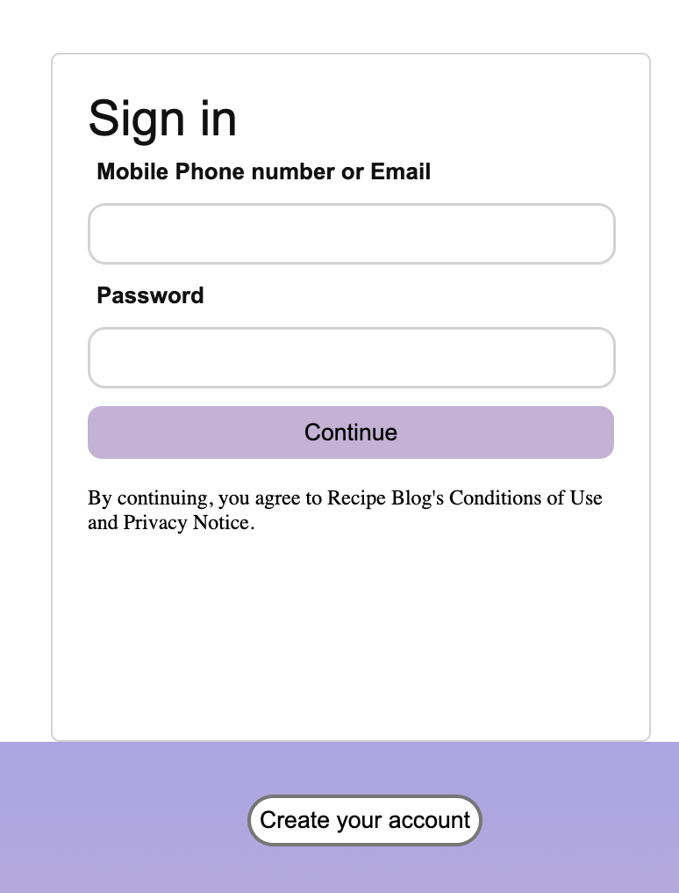
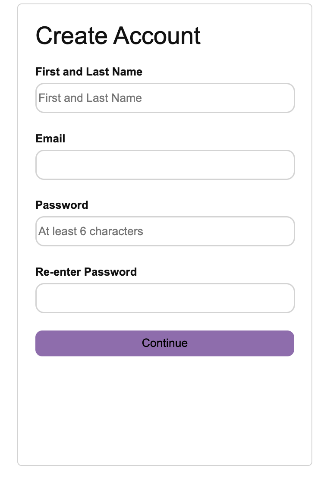

<!-- This is a [Next.js](https://nextjs.org/) project bootstrapped with [`create-next-app`](https://github.com/vercel/next.js/tree/canary/packages/create-next-app).

## Getting Started

First, run the development server:

```bash
npm run dev
# or
yarn dev
# or
pnpm dev
```

Open [http://localhost:3000](http://localhost:3000) with your browser to see the result.

You can start editing the page by modifying `app/page.js`. The page auto-updates as you edit the file.

This project uses [`next/font`](https://nextjs.org/docs/basic-features/font-optimization) to automatically optimize and load Inter, a custom Google Font.

## Learn More

To learn more about Next.js, take a look at the following resources:

- [Next.js Documentation](https://nextjs.org/docs) - learn about Next.js features and API.
- [Learn Next.js](https://nextjs.org/learn) - an interactive Next.js tutorial.

You can check out [the Next.js GitHub repository](https://github.com/vercel/next.js/) - your feedback and contributions are welcome!

## Deploy on Vercel

The easiest way to deploy your Next.js app is to use the [Vercel Platform](https://vercel.com/new?utm_medium=default-template&filter=next.js&utm_source=create-next-app&utm_campaign=create-next-app-readme) from the creators of Next.js.

Check out our [Next.js deployment documentation](https://nextjs.org/docs/deployment) for more details.
# capstone-project -->


# Recipe Blog

## Table of Contents

- [Introduction](#introduction)
- [Wireframes](#wireframes)
- [Features](#features)
<!-- - [Prerequisites]
- [Installation]
- [API Endpoints]
- [Testing] -->


## Introduction

A recipe blog is a digital platform where individuals share their culinary adventures, recipes, and dining experiences, offering a mouthwatering blend of food photography and gastronomic storytelling to inspire and inform fellow food enthusiasts.

## Wireframes
- Login Page :

 

- SignUp Page :



- Food Blog Web Page


- ERD 


## Features

Main features of the project:

- Users : Registered users can access a range of features that enhance their culinary journey and food exploration.
- Recipes: Detailed instructions for preparing various dishes, often accompanied by mouthwatering photos.
- Ingredient Information: Insights into different ingredients, their uses, and where to find them.

## Prerequisites

List of the prerequisites/requirements needed to run the project.

- Node.js
- Next JS
- React
- Express.js
- MongoDB
- JWT (JSON Web Tokens) for authentication
- Nodemon
- Postman

## 